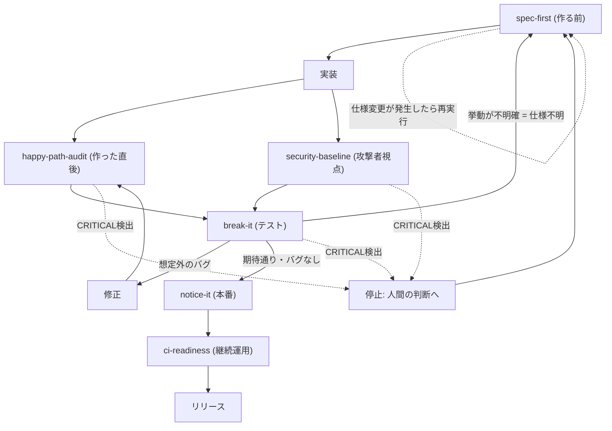

# vibe-coding-checklist — フィードバックループの実行版

対応章: [第10章 実践](../../../chapters/10-practice.md)

## 目的

[第10章](../../../chapters/10-practice.md)の「通しチェックリスト」を実行する。ただし実開発は一方向のパイプラインでは進まない。**AIに一発で正解を出させる仕組みではなく、間違えることを前提に、間違いを次の判断材料へ変換する仕組み**として設計する。仕様変更、バグ発見、仕様不明の判明は、いずれも前の段階に戻る正当なルートであり、失敗ではない。

## 全体像（フィードバックループ）



- `break-it`は分岐点: バグは`happy-path-audit`への短いループ（修正→再チェック）、仕様不明は`spec-first`への長いループ（仕様確定からやり直す）に分かれる
- `spec-first`はループの合流点: 仕様変更、仕様不明の差し戻し、CRITICAL停止からの再開、すべてがここに集まる
- どの段階でもCRITICALな問題を見つけたら、残りの段階を実行せず即座に停止する（下記）

## 停止条件（CRITICAL）

次のいずれかを検出した場合、**それ以降の段階を実行せず、パイプラインを停止して人間の判断に戻す**。CIの確認や他の項目の消化より優先する。

```
CRITICAL:
- 本番データ破壊の可能性（不可逆な削除、バックアップ無しの上書きなど）
- 認証・認可の重大な欠陥（誰でも他人のデータを操作できる等）
- 秘密情報漏洩（ログ・レスポンス・エラーメッセージへの露出を含む）
- 仕様未確定のまま実装・リリースを要求されている
```

停止した場合は、検出したskillの名前・検出内容・なぜCRITICALと判断したかを明示し、対応（`spec-first`での仕様確定、該当箇所の修正など）が終わるまで次の段階には進まない。

## 使うタイミング

- 実装が一段落し、PRを作成する前
- 機能をリリースする前の最終確認
- 「一通りチェックして」とだけ依頼された時

## 手順

1. **spec-first**を実行し、受け入れ条件を確定する
2. **happy-path-audit**と**security-baseline**を実行する。CRITICALを検出したら即停止
3. **break-it**を実行し、手順2の出力を最優先でテスト化する。結果を3種類に分類する
   - 想定外のバグ → 修正 →（軽い回帰確認として）**happy-path-audit**に戻り、直った範囲だけ再確認してから4へ進む
   - 挙動が不明確（仕様不明） → **spec-first**に差し戻し、仕様が確定してから該当項目だけ再度2〜3を実行する
   - 期待通り／バグなし → そのまま4へ進む
4. **notice-it**を実行する。break-itで見つかった「本番で起きうる失敗パターン」と、アラート基準（ログのみか通知か）を確認する
5. **ci-readiness**を実行する。CIの信頼性とCI/本番の差を確認する
6. 各skillの出力を[第10章の通しチェックリスト](../../../chapters/10-practice.md#通しチェックリスト)のチェックボックスに対応させ、済/未/差し戻し中のステータスでまとめる

未確定の仕様やCRITICALな指摘が残っている項目は、それらが解決するまで「済」にしない。

## 出力フォーマット

```
## 通しチェックリスト結果: <対象機能名>

### CRITICAL
(なし。あれば最上部にこの節を出し、他の結果より先に報告する)

### パイプライン実行結果
1. spec-first: 受け入れ条件2件確定、未回答の質問1件あり
2. happy-path-audit / security-baseline: 未対応2件（rate負数、存在しないIDで500）、
   認可漏れ1件（delete_user、他人のリソースを削除可能）
3. break-it:
   - 想定外のバグ: rate負数 → 修正 → happy-path-auditで再確認済み
   - 仕様不明 → spec-firstへ差し戻し中: 「APIタイムアウト時の挙動」
   - 期待通り: 存在しないIDの404
4. notice-it: 決済の途中終了はログ・検知・通知いずれも未対応 → 最優先の残課題
5. ci-readiness: CIはあるがマージゲートになっていない。CIはSQLite/本番はPostgreSQLで差あり

### 総評
「APIタイムアウト時の挙動」の仕様確定が全体のブロッカー。それ以外は決済の途中終了対応、
CIのマージゲート化の順で対応するのが優先度が高い。
```

## やらないこと

- CRITICALを検出したまま後段の実行や「済」判定を進めない
- 各skillの判定結果を上書き・簡略化しない。各skillの出力をそのまま集約する
- 「済」判定を推測で出さない。各skillを実際に実行した結果のみを反映する
- ループを一度回しただけで完了とみなさない。差し戻し中の項目が解決するまで、該当箇所は再チェック対象として残す
