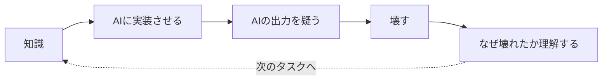
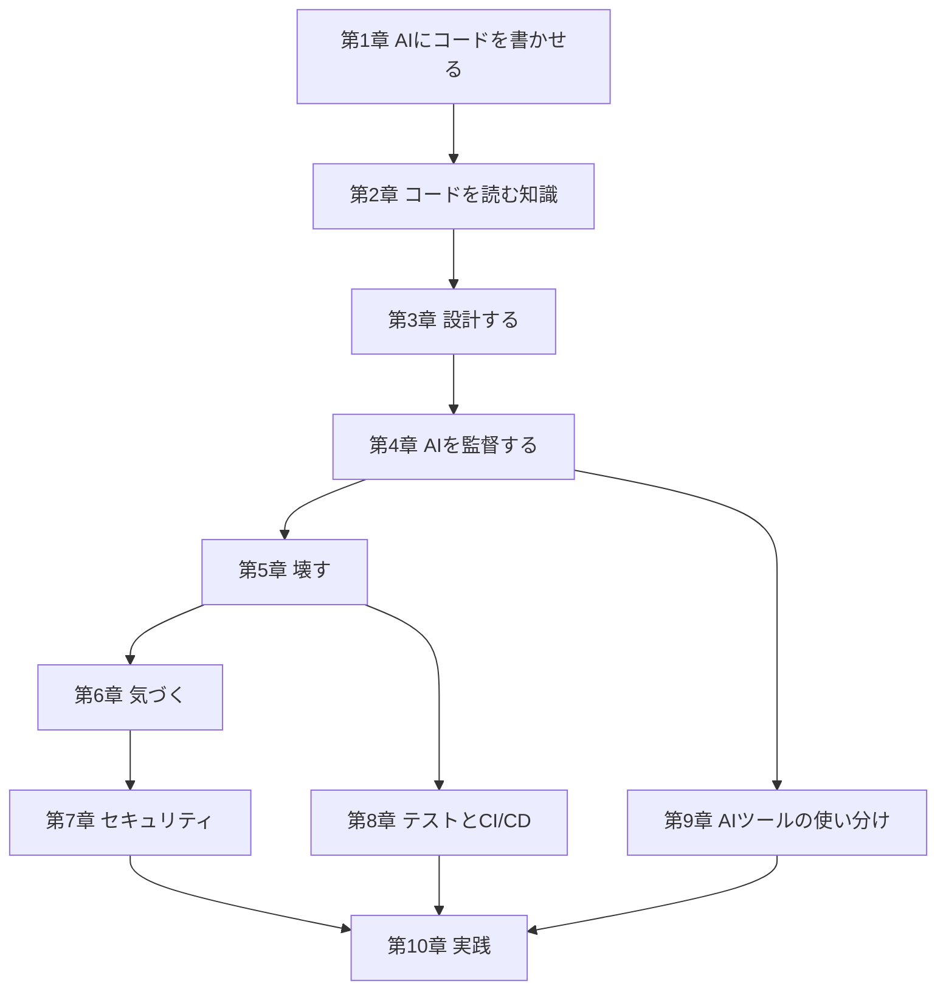

# AIとコードを書くための教科書
### バイブコーディングに最低限必要な知識

---

## はじめに

バイブコーディングの本当の問題点は、「コードが書けないこと」ではない。**自分が今何をしていて、何が起きているかを言語化できないこと**だ。

AIは万能翻訳機ではない。頭の中の「なんかこう、いい感じにしたい」を正確なコードに変換する装置ではなく、**与えた言葉の精度でしか働かない**装置だ。この本は、その言葉の精度を上げるための最短ルートを示す。

各章は次の流れで進む。

> 知識 → AIに実装させる → AIの出力を疑う → 壊す → なぜ壊れたか理解する

全部を一度に暗記する必要はない。「この概念の存在を知っていて、必要になったら深掘りできる」状態がゴールだ。

---

## 目次

| 章 | タイトル | 内容 | 目安時間 | 難易度 |
|---|---|---|---|---|
| 1 | [AIにコードを書かせる](chapters/01-ai-writes-code.md) | バイブコーディングの前提、AIに任せていい仕事の境界、AIの限界 | 5分 | 易 |
| 2 | [コードを読むための最低限の知識](chapters/02-reading-code.md) | 変数・型・非同期・エラー処理・API・Gitなど、読解に必要な最低限の語彙 | 10分 | 易〜中 |
| 3 | [設計する](chapters/03-design.md) | 要件と仕様、抽象化、責務分離、状態・データ・アーキテクチャ設計 | 10分 | 中 |
| 4 | [AIを監督する](chapters/04-supervising-ai.md) | 良いプロンプト、タスク分解、設計→実装→検証、AIへのレビュー依頼 | 7分 | 易 |
| 5 | [壊す](chapters/05-breaking-it.md) | 境界値・異常系・同時実行などの壊し方と、テストコードへの変換 | 8分 | 中 |
| 6 | [気づく](chapters/06-noticing.md) | ログ設計、エラー通知・監視、壊れたことに気づける状態を作る | 6分 | 易 |
| 7 | [セキュリティ](chapters/07-security.md) | SQL Injection、XSS、CSRF、認証・認可、秘密情報の扱い | 12分 | 中〜難 |
| 8 | [テストとCI/CD](chapters/08-testing-and-cicd.md) | テストピラミッド、継続的インテグレーション/デリバリーの基礎 | 8分 | 中 |
| 9 | [AIツールの使い分け](chapters/09-choosing-ai-tools.md) | チャット型・IDE統合型・CLI/エージェント型・自律実行型の使い分け | 7分 | 易 |
| 10 | [実践](chapters/10-practice.md) | サンプルプロジェクトで、知識→実装→検証のループを実際に回す | 15分 | 中 |
| 付録 | [あれば便利な知識](appendix.md) | 環境構築、CLI、正規表現、ライセンスなど、周辺知識 | 5分 | 易 |
| — | [おわりに](conclusion.md) | 本書全体のまとめと、この先の使い方 | 3分 | 易 |

## その他の資料

- [用語集](glossary.md) — 本書に出てくる専門用語の逆引き辞典
- [FAQ・よくある詰まりどころ](faq.md) — 実際に手を動かして出てくる悩みへの回答集
- [参考資料・次に読むべきもの](further-reading.md) — もっと深掘りしたい人向けの外部資料
- [LICENSE](LICENSE) — 本書はCC BY-SA 4.0で公開している

## 同梱スキル

本書の内容を、実際のコードに対して実行できる指示ファイル（`SKILL.md`）として[skills/](skills/README.md)に同梱している。プレーンなMarkdownなので、Claude Codeに限らず他のAIツールにも渡して使える（詳細は[skills/README.md](skills/README.md)を参照）。各章のページにも、対応するskillへのリンクを置いている。

| skill | 対応章 | 役割 |
|---|---|---|
| [spec-first](skills/spec-first/SKILL.md) | 3・4章 | 作る前 |
| [happy-path-audit](skills/happy-path-audit/SKILL.md) | 1・5章 | 作った直後 |
| [break-it](skills/break-it/SKILL.md) | 5章 | テスト |
| [notice-it](skills/notice-it/SKILL.md) | 2・3・6章 | 本番 |
| [security-baseline](skills/security-baseline/SKILL.md) | 7章 | 攻撃者視点 |
| [ci-readiness](skills/ci-readiness/SKILL.md) | 8章 | 継続運用 |
| [ai-tool-picker](skills/ai-tool-picker/SKILL.md) | 9章 | ツール選定 |
| [vibe-coding-checklist](skills/vibe-coding-checklist/SKILL.md) | 10章 | 上記全体のフィードバックループ実行版 |

## 章の依存関係

どの章がどの章を前提にしているかの目安。上から順に読むのが基本だが、第8章・第9章はそれぞれ第5章・第4章の応用にあたる。

---

## 本書の使い方

- 最初から通しで読んでもいいし、詰まった時に該当章だけを辞書的に引いてもいい
- 各章末に**演習**を用意した。答えを覚えるより、自分が今触っているコードで実際に試すほうが身につく
- 第10章の「実践」は他の全章を使う総合演習になっている。一通り読んだ後は、まずここから手を動かすのがおすすめ

---

第1章から読み進めるには、[第1章　AIにコードを書かせる](chapters/01-ai-writes-code.md) へ。
